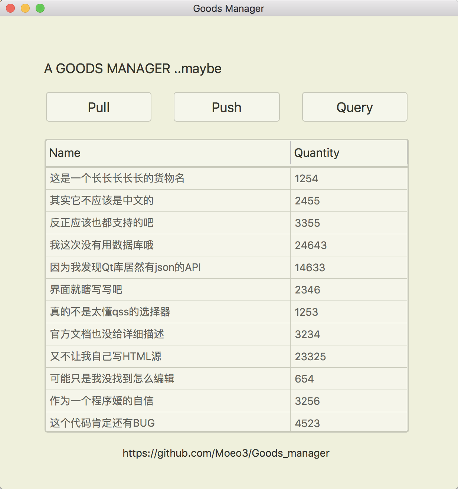
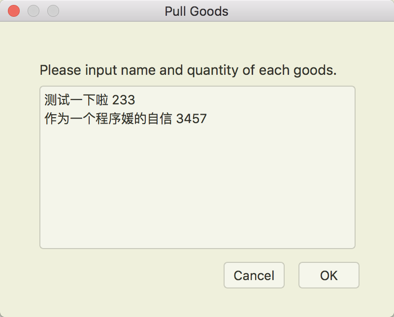
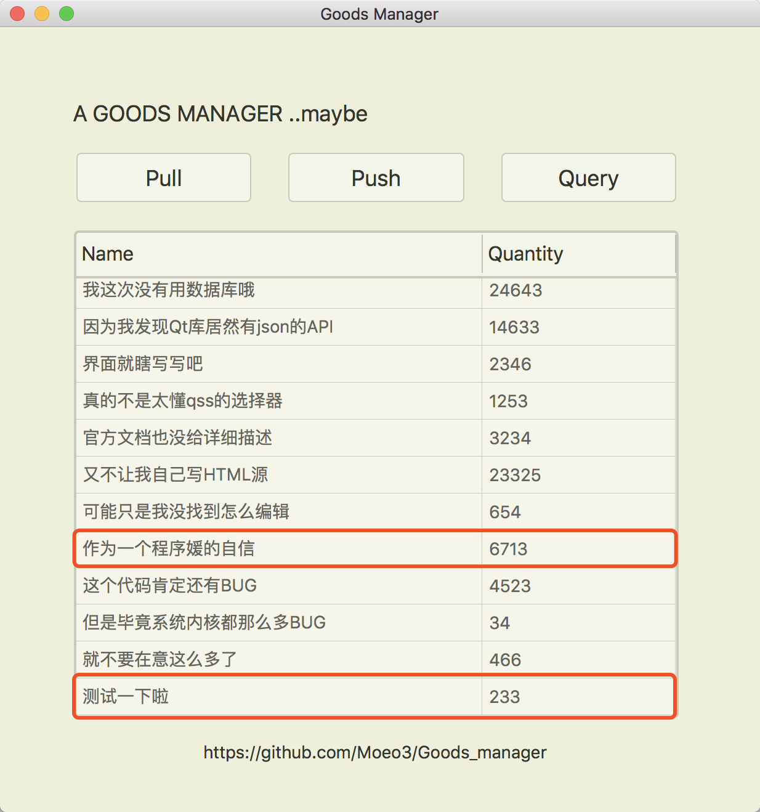
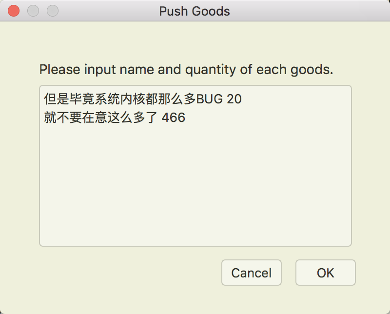
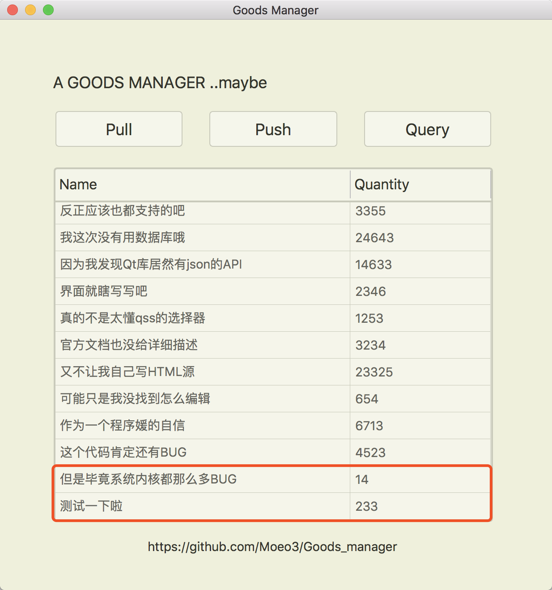
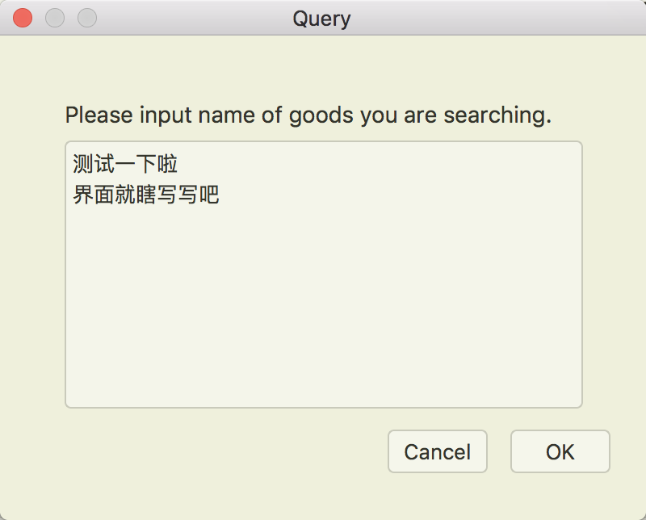
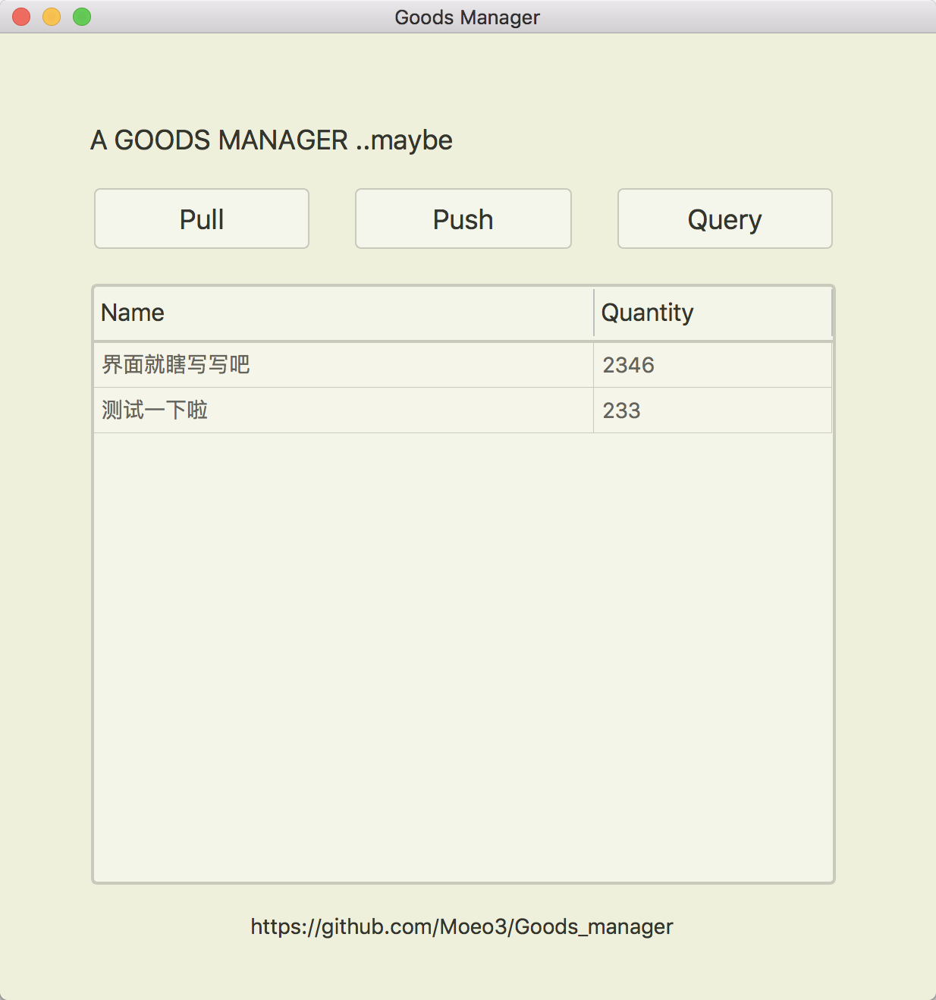

# Project 1技术报告

### 姓名：张倩如 	学号：16339051	  班级：教务1班

## 需求分析：
    库管理系统的功能如下：
    1. 在仓库进货时，如果仓库中没有此商品，则为仓库增添新的商品项目
    2. 在仓库进货时，如果仓库中已有此商品，则增加此商品的库存量
    3. 在仓库出货时，减少对应商品的库存量
    4. 在仓库出货时，如果这是货物是此商品的最后一批货（库存量为0），则删除仓库中此商品项目
    5. 查询功能：可以随时查看当前仓库的库存，包括商品名和剩余量

## 实现思路：
    本仓库管理系统主要分为出货、进货、查询三大模块，分别对出货、进货和查询的操作进行管理。
    进货模块中又细分为增加库存和新增商品子功能，当进货时，若此商品在仓库中没有库存，则在仓库库存条目中新增此商品项目，若已有此类商品，则根据进货量增加对应的库存量。
    出货模块中又细分为减少库存和删除商品子功能，当出货时，减少对应商品的数目，注意到当库存不足时，出货失败，且若出货成功并且库存为0时，删除仓库目录中此商品项目。
    查询模块，分为显示库存和查找某一商品是否存在库存及其库存量

## 数据设计：
```C++
class goods
{
public:
    goods();
    goods(const QString &name, int quantity);

    void set_name(const QString &name);
    QString name();
    void set_quantity(int quantity);
    int quantity();

    void read(const QJsonObject &json);
    void write(QJsonObject &json) const;
private:
    QString mname;
    int mquantity;
};
```

## 函数设计：
```C++
    void put_them_in(QString, int);
    void put_them_out(QString, int);
    void update_table();
    void selcet_table(QStringList);
```

## 输入与输出：
    You can operate multiple goods at the same time, separating each one with a line feed.
    You are supposed to separate the name and quantity of the goods by space when you pull or push.
    You can use any language you like (I guess).

## 操作演示：
* 初始界面，已经读取了json<br />
<br />
<br />
* 点击进货按钮后输入进货物品和数量：<br />
<br />
<br />
* 进货完成，更新表格：<br />
<br />
<br />
* 点击出货按钮后输入出货物品和数量：<br />
<br />
<br />
* 出货完成，更新表格：<br />
<br />
<br />
* 点击查询按钮查询物品：<br />
<br />
<br />
* 表格只显示正在查询的物品啦：<br />
<br />
<br />

## 完整代码：
<https://github.com/Moeo3/Goods_manager>